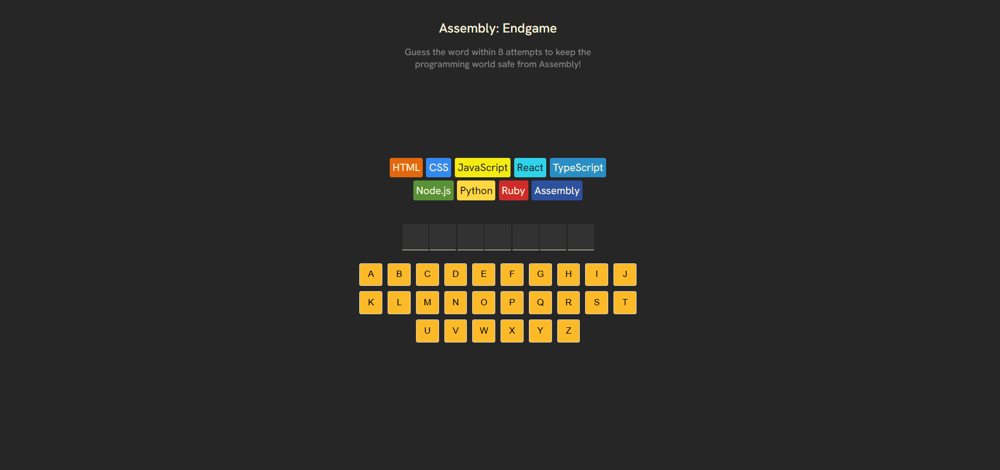
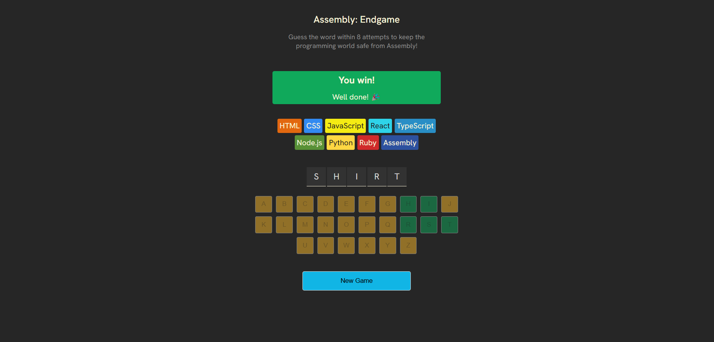
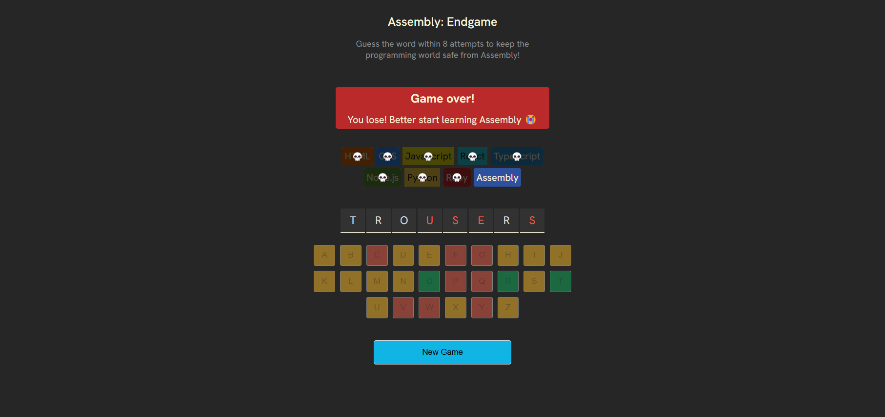

# React + Vite

This template provides a minimal setup to get React working in Vite with HMR and some ESLint rules.

Currently, two official plugins are available:

- [@vitejs/plugin-react](https://github.com/vitejs/vite-plugin-react/blob/main/packages/plugin-react/README.md) uses [Babel](https://babeljs.io/) for Fast Refresh
- [@vitejs/plugin-react-swc](https://github.com/vitejs/vite-plugin-react-swc) uses [SWC](https://swc.rs/) for Fast Refresh

## Project Images

This is the main screen of the game where player start their journey. The interface is user-friendly with clear instructions and controls.

This screen appears when the player wins the game. It displays the options to restart the game.

This screen appears when the player loses the game. It displays the final display and options to restart the game.

